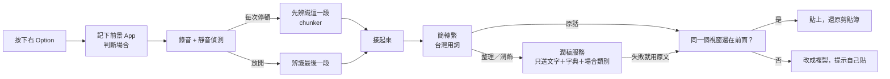

# 架構

給想讀或改程式碼的人。使用說明在 [使用指南](使用指南.md)。

默契是 [Tauri 2](https://tauri.app/) 桌面 App：後端 Rust，前端 React + TypeScript。它從 [Handy](https://github.com/cjpais/Handy) 分支，錄音、快捷鍵、懸浮窗、模型管理沿用 Handy；辨識之後的「產品層」是默契自己的，集中在兩個資料夾：

| 位置                   | 內容                                                         |
| ---------------------- | ------------------------------------------------------------ |
| `src-tauri/src/yuyin/` | 後端產品層：場合判斷、邊說邊轉、整理、輸出、統計、鑰匙圈     |
| `src/yuyin/`           | 前端：主視窗（首頁、歷史、字典、設定）、膠囊、第一次開啟引導 |

改到 Handy 原本檔案的地方都標了 `Yuyin fork:`，規則見 [FORK.md](../FORK.md)。

## 一次說話的流程

1. **按下**：`session::begin` 記下前景 App、焦點視窗，由 `context` 在本機判斷場合（聊天、對 AI、筆記、其他）。App 名稱和視窗標題不會送出。
2. **說話中**：錄音器每一格都經過 Silero 靜音偵測。`chunker` 在句間停頓（0.75 秒；一段超過 8 秒後，換氣 0.25 秒也算）時，把目前為止的語音先交給辨識模型。
   每一段辨識時，`asr_vocab` 把字典裡最近用到的 50 個詞（中文轉簡體）交給模型當詞彙表。字典讓模型開始重複時，那一段改用不帶字典再辨識一次，絕不掉字。
3. **放開**：只剩最後一段要辨識。各段接起來後，`wording` 用 OpenCC（s2twp）轉成台灣繁體用詞。`learn` 套用學到的改法（整理前後各一次）。
4. **整理**：`polish` 用 `prompt` 裡的指令，連同字典和場合類別送到使用者選的服務（預設 DeepSeek，推理關閉、溫度 0）。逾時、斷網、輸出不合理時，一律改用原文。
5. **輸出**：`session::focus_changed` 確認使用者還在同一個視窗，才貼上；否則 `output::copy_instead` 改成複製並提示。貼上後還原原本的剪貼簿。
6. **紀錄**：歷史存進 SQLite（最近 100 筆），計時和字數寫進 `yuyin_timings.jsonl`，首頁統計由 `stats` 從這裡算。
7. **學習**：開了「從我的修改學習」時，`learn` 讀那個輸入框，看使用者改了什麼（VS Code 這類 App 在按下時由 `session::wake_accessibility` 請它開放）；在歷史紀錄按「修正」則直接比對紀錄和改好的文字。聽錯的字（改成英文詞，或讀音相近的中文）一次就學，讀音不同的改動兩次才學；聽錯的詞也加進字典。

## 後端模組（`src-tauri/src/yuyin/`）

| 模組                  | 做什麼                                                   |
| --------------------- | -------------------------------------------------------- |
| `session`             | 一次說話從按下到貼上的狀態；前景 App、焦點檢查、計時紀錄 |
| `context`             | 從 App 和視窗標題判斷場合，只輸出類別                    |
| `chunker`             | 邊說邊轉：在停頓處先辨識，放開後只等最後一段             |
| `asr_vocab`           | 字典交給辨識：最近用到的 50 個詞                         |
| `learn`               | 從修改學習：找出改了哪些詞、學成改法、套用               |
| `wording`             | 簡轉繁、台灣用詞                                         |
| `polish` / `prompt`   | 呼叫潤稿服務；三種潤飾程度的指令                         |
| `output`              | 膠囊的完成狀態；不能貼時改成複製                         |
| `stats`               | 首頁數字和每筆歷史的細節，全部在本機計算                 |
| `secrets`             | API key 存取 macOS 鑰匙圈；前端只能設定、不能讀回        |
| `config` / `defaults` | 默契自己的設定，以及第一次啟動的預設值                   |
| `app_menu`            | 依介面語言顯示選單列（也讓 ⌘C／⌘V 在輸入框能用）         |
| `replay`              | 開發用：把錄音檔重播過邊說邊轉，做回歸比較               |
| `field_probe`         | 開發用的可行性記錄，預設完全關閉（見 [隱私](隱私.md)）   |

其他重要的 Handy 部分：`shortcut/`（全域快捷鍵，macOS 用 CGEventTap）、`transcription_coordinator.rs`（按住／放開／免持的狀態機）、`managers/`（錄音、模型、辨識、歷史）、`overlay.rs`（懸浮膠囊，NSPanel）。

## 辨識

- 模型：[Qwen3-ASR 1.7B](https://github.com/QwenLM/Qwen3-ASR)（Q5_K_M GGUF），透過 [transcribe.cpp](https://github.com/handy-computer/transcribe.cpp) 在 Metal 上執行。
- 固定用中文模式（`-l zh`）；不固定的話，英文多的句子會被整句翻成英文。
- 引擎 transcribe-cpp 0.3.1：Qwen3-ASR 官方支援詞彙表（`RunOptions::vocabulary`），默契用它把字典交給辨識。
- 選模型的過程和數字見 [評測](評測.md)。

## 前端（`src/yuyin/`）

- `window/`：主視窗的四頁。`HomePage` 的數字來自後端 `yuyin_stats`；`HistoryPage` 每筆的「這次送出了什麼」來自 `yuyin_history_meta`。
- `Capsule.tsx` + `capsule.css`：錄音時的懸浮膠囊。
- `onboarding/`：第一次開啟的三步。
- `api.ts`：呼叫後端指令的薄包裝。

## 資料放在哪裡

全部在 `~/Library/Application Support/tw.yuyin.dictation/`，兩個例外：API key 在鑰匙圈；辨識模型由 Handy 的模型管理下載到 Hugging Face 的共用快取 `~/.cache/huggingface/hub/`。清單見 [隱私](隱私.md#資料放在哪裡)。
